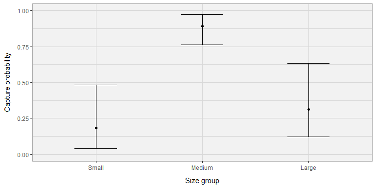
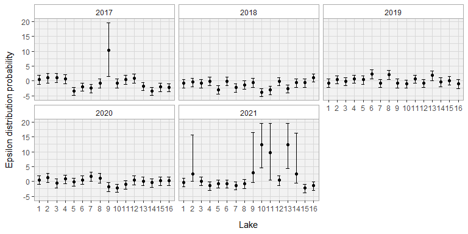
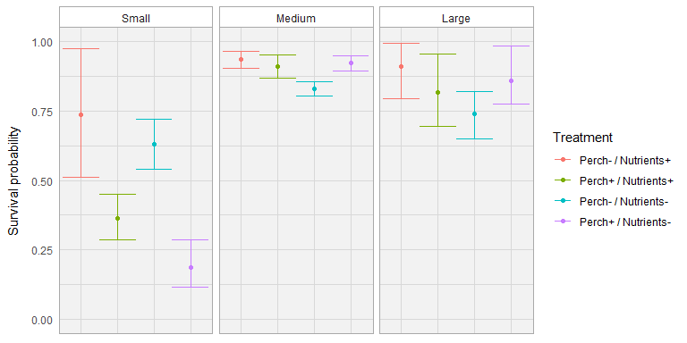
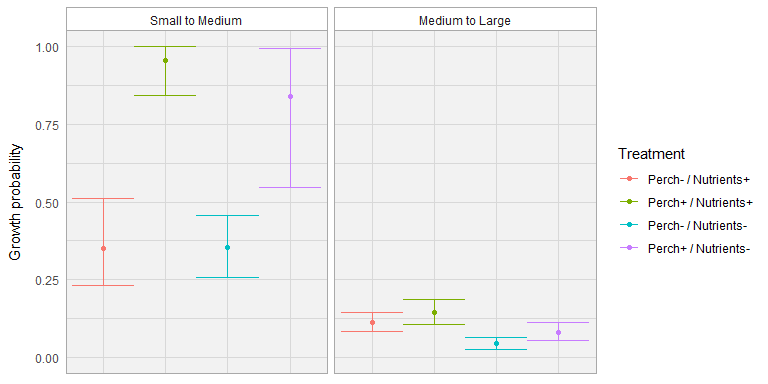
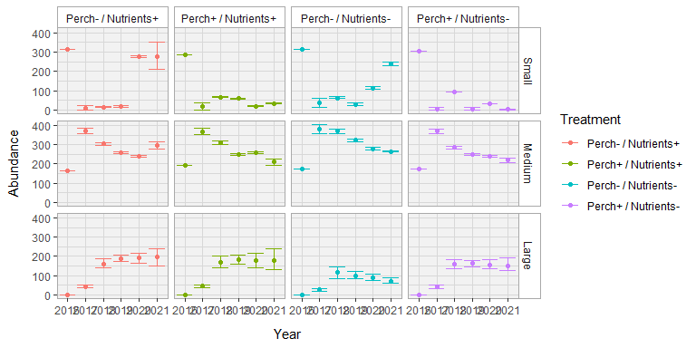

R Notebook
================

``` r
theme_set(theme_bw()+
            theme(strip.background =element_rect(fill="white", color = "darkgrey"),
                  panel.background = element_rect(fill = "#F2F2F2"),
                  panel.grid = element_line(colour = "#D8D8D8"),
                  panel.border = element_rect(color = "darkgrey"),
                  axis.title.x = element_text(margin = margin(t = 10)),
                  axis.title.y = element_text(margin = margin(r = 10))))
```

``` r
model = Model_Treatment_capture

ggplot(get_p(model))+
  geom_point(aes(x = Size, y = mean))+
  geom_errorbar(aes(x = Size, 
                    ymin = min, ymax = max), width = 0.4)+
  labs(y = "Capture probability", x = "Size group")+
  ylim(0,1)
```

<!-- -->

``` r
ggplot(get_epsilon(model))+
  geom_point(aes(x = factor(Lake), y = mean))+
  geom_errorbar(aes(x = factor(Lake), ymin = min, ymax = max), width = 0.4)+
  facet_wrap(~Year)+
  labs(x = "Lake", y = "Epsilon distribution probability")
```

    ## `summarise()` has grouped output by 'Lake'. You can override using the
    ## `.groups` argument.

<!-- -->

``` r
ggplot(get_phi(model) %>% filter(Exp_time == "After treatment"), aes(color = factor(Treatment)))+
  geom_point(aes(x = Treatment, y = mean))+
  geom_errorbar(aes(x = Treatment, ymin = min, ymax = max), width = 1)+
  scale_color_discrete("Treatment")+
  facet_wrap(~Size)+
  theme(axis.text.x=element_blank(),axis.ticks=element_blank(),axis.title.x=element_blank())+
  labs(y = "Survival probability")+
  ylim(0,1)
```

    ## `summarise()` has grouped output by 'Size', 'Treatment'. You can override using
    ## the `.groups` argument.

<!-- -->

``` r
ggplot(get_psi(model) %>% filter(Exp_time == "After treatment"), aes(color = factor(Treatment)))+
  geom_point(aes(x = Treatment, y = mean))+
  geom_errorbar(aes(x = Treatment, ymin = min, ymax = max), width = 1)+
  facet_wrap(~Size)+
  scale_color_discrete("Treatment")+
  theme(axis.text.x=element_blank(),axis.ticks=element_blank(),axis.title.x=element_blank())+
  labs(y = "Growth probability")+
  ylim(0,1)
```

    ## `summarise()` has grouped output by 'Size', 'Treatment'. You can override using
    ## the `.groups` argument.

<!-- -->

``` r
ggplot(get_n(model),aes(y = mean, x = Year, color = Treatment))+
  geom_point(aes(y = mean, x = Year, color = Treatment))+
  #geom_line(aes(group = Treatment))+
  geom_errorbar(aes(ymin = min, ymax = max, x = Year, color = Treatment))+
  facet_grid(rows = vars(Size), cols = vars(Treatment))+
  labs(y = "Abundance")
```

    ## `summarise()` has grouped output by 'Size', 'Treatment'. You can override using
    ## the `.groups` argument.

<!-- -->
