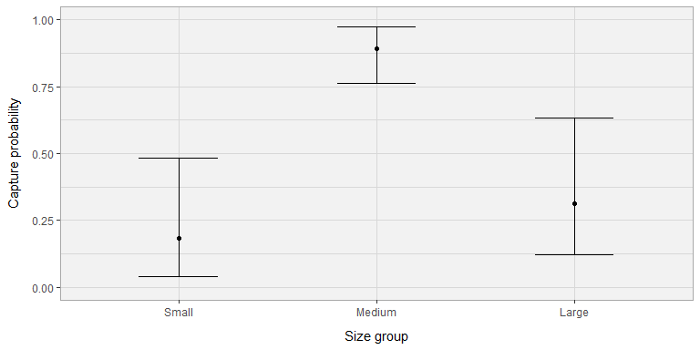
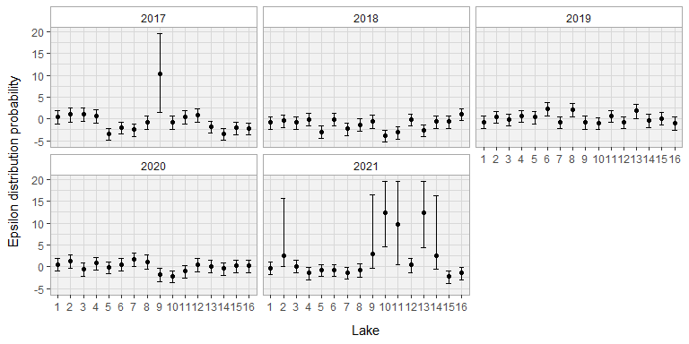
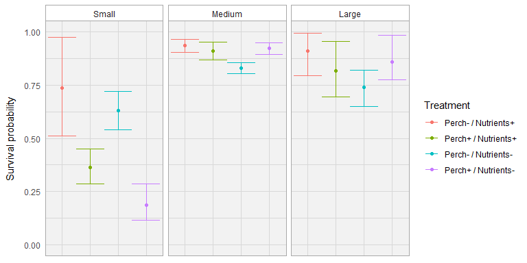
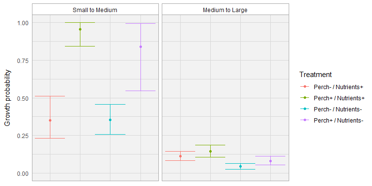
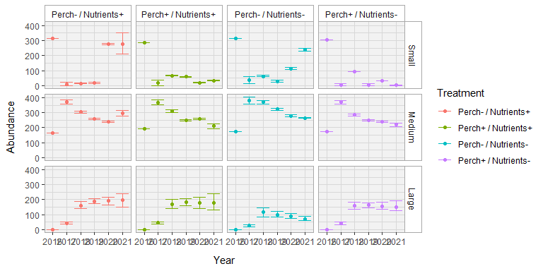

Model result visualisation
================

## Capture Probability and variability

### Mean capture probability

<!-- -->

### Variation around mean capture probability for each event

<!-- -->

## Survival

<!-- -->

## Growth

<!-- -->

## Abundance

<!-- -->

## You can get a table of the result with uncertainty :

``` r
knitr::kable(head(data.frame(Model_Treatment_capture[[2]][10])))
```

|                | summary.mean |  summary.sd | summary.2.5. |  summary.25. |  summary.50. | summary.75. | summary.97.5. | summary.Rhat | summary.n.eff |
|:---------------|-------------:|------------:|-------------:|-------------:|-------------:|------------:|--------------:|-------------:|--------------:|
| deviance       | 7005.6346938 | 124.6391090 | 6751.1381813 | 6926.1686611 | 7003.9904164 | 7090.935962 |   7244.234139 |     1.007887 |           320 |
| epsilon\[1,1\] |    0.4556950 |   0.7903032 |   -1.1541838 |   -0.0359455 |    0.4625370 |    1.005820 |      1.920502 |     1.027207 |            61 |
| epsilon\[2,1\] |    0.9937290 |   0.8024652 |   -0.6822590 |    0.4542631 |    1.0327735 |    1.553853 |      2.482796 |     1.022744 |            72 |
| epsilon\[3,1\] |    1.0255963 |   0.8181073 |   -0.5700092 |    0.4770020 |    1.0478540 |    1.602575 |      2.596823 |     1.014995 |           110 |
| epsilon\[4,1\] |    0.6501348 |   0.7757778 |   -0.9737234 |    0.1564732 |    0.6866518 |    1.188010 |      2.108912 |     1.022355 |            73 |
| epsilon\[5,1\] |   -3.4471784 |   0.7091455 |   -4.9482511 |   -3.8767529 |   -3.3978149 |   -2.940931 |     -2.246192 |     1.037529 |            46 |
